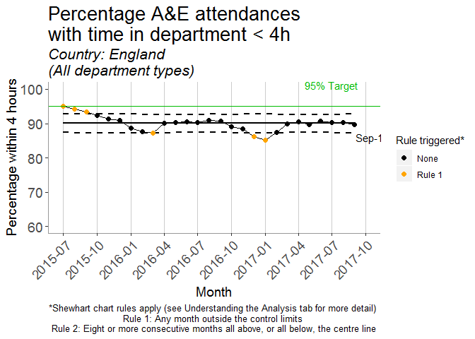
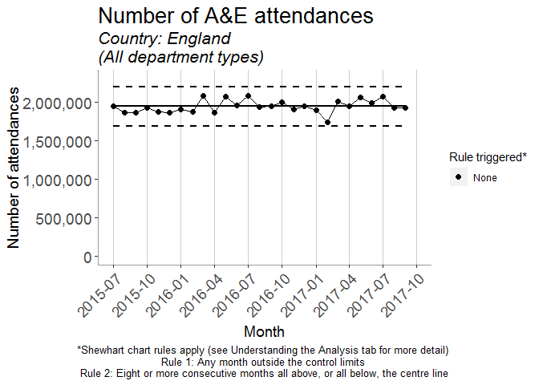

<!-- README.md is generated from README.Rmd. Please edit that file -->
AE-app
======

The goal of AE-app is to provide interactive analysis of time series data on accident and emergency department attendances. A live instance of the app can be found [here](https://clahrcnwl.shinyapps.io/ae-app/).

The app currently provides analysis of the monthly number of attendances, and the percentage of attendances where the patient was admitted, transferred or discharged within four hours of arrival. The app performs this analysis for publicly available [NHS England](https://www.england.nhs.uk/statistics/statistical-work-areas/ae-waiting-times-and-activity/) and [NHS Scotland](http://www.isdscotland.org/Health-Topics/Emergency-Care/Publications/data-tables2017.asp?id) data.

More details on the methods used can be found in the "Understanding the analysis" tab of the app.

Example analyses
================

Example control chart analyses are shown below for the whole of England.

``` r
source("perf_4h_analysis.R")
#> Warning: package 'tidyverse' was built under R version 3.4.4
#> -- Attaching packages ---------------------------------------------------------- tidyverse 1.2.1 --
#> v ggplot2 3.0.0     v purrr   0.2.5
#> v tibble  1.4.2     v dplyr   0.7.6
#> v tidyr   0.8.1     v stringr 1.3.1
#> v readr   1.1.1     v forcats 0.3.0
#> Warning: package 'ggplot2' was built under R version 3.4.4
#> Warning: package 'tibble' was built under R version 3.4.4
#> Warning: package 'tidyr' was built under R version 3.4.4
#> Warning: package 'purrr' was built under R version 3.4.4
#> Warning: package 'dplyr' was built under R version 3.4.4
#> Warning: package 'stringr' was built under R version 3.4.4
#> Warning: package 'forcats' was built under R version 3.4.4
#> -- Conflicts ------------------------------------------------------------- tidyverse_conflicts() --
#> x dplyr::filter() masks stats::filter()
#> x dplyr::lag()    masks stats::lag()
#> Warning: package 'qicharts2' was built under R version 3.4.4
#> 
#> Attaching package: 'scales'
#> The following object is masked from 'package:purrr':
#> 
#>     discard
#> The following object is masked from 'package:readr':
#> 
#>     col_factor
#> Warning: package 'zoo' was built under R version 3.4.4
#> 
#> Attaching package: 'zoo'
#> The following objects are masked from 'package:base':
#> 
#>     as.Date, as.Date.numeric
#> Warning: package 'lubridate' was built under R version 3.4.4
#> 
#> Attaching package: 'lubridate'
#> The following object is masked from 'package:base':
#> 
#>     date
source("spc_rules.R")
AE_Data <- nhsAEscraper::getAE_data(update_data = TRUE, directory = 'data-raw')
#> Warning in file.remove(dir(directory, pattern = "*", full.names = TRUE)):
#> cannot remove file 'data-raw/sitreps', reason 'Permission denied'
#> Warning: package 'bindrcpp' was built under R version 3.4.4
AE_Data_CRC <- clean_region_col(AE_Data)
plot_performance(df = AE_Data_CRC, code = 'E', brk.date = NULL, measure = 'All',
                 start.date = "2015-07-01", end.date = "2017-09-30", level = "National")
```



``` r

plot_volume(df = AE_Data_CRC, code = 'E', brk.date = NULL, measure = 'All',
                 start.date = "2015-07-01", end.date = "2017-09-30", level = "National")
```


