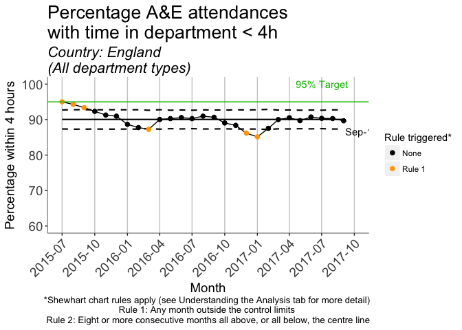
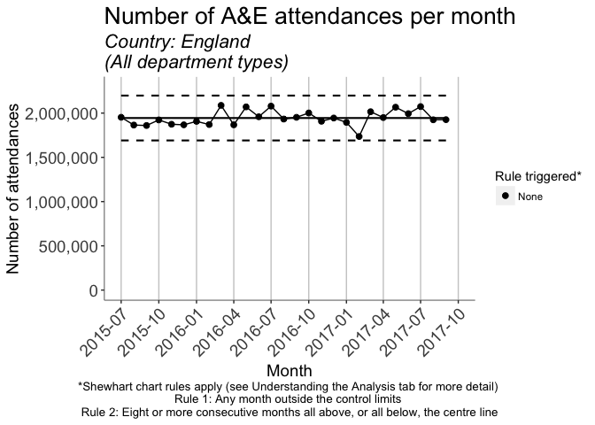

<!-- README.md is generated from README.Rmd. Please edit that file -->
AE-app
======

The goal of AE-app is to provide interactive analysis of time series data on accident and emergency department attendances. A live instance of the app can be found [here](https://clahrcnwl.shinyapps.io/ae-app/).

The app currently provides analysis of the monthly number of attendances, and the percentage of attendances where the patient was admitted, transferred or discharged within four hours of arrival. The app performs this analysis for publicly available [NHS England](https://www.england.nhs.uk/statistics/statistical-work-areas/ae-waiting-times-and-activity/) and [NHS Scotland](http://www.isdscotland.org/Health-Topics/Emergency-Care/Publications/data-tables2017.asp?id) data.

More details on the methods used can be found in the "Understanding the analysis" tab of the app.

Run the app locally
-------------------

You will need to install the following packages:

``` r
install.packages(c('shiny','shinydashboard','tidyverse','stringr','qicharts2','scales','zoo','wktmo','testthat'))
devtools::install_github('HorridTom/nhsAEscraper')
```

After cloning this repo, the app can then be run as usual with the command:

``` r
shiny::runApp()
```

Note that with the default settings the app requires a live internet connection, to download the data.

Example analyses
----------------

Example control chart analyses are shown below for the whole of England.


